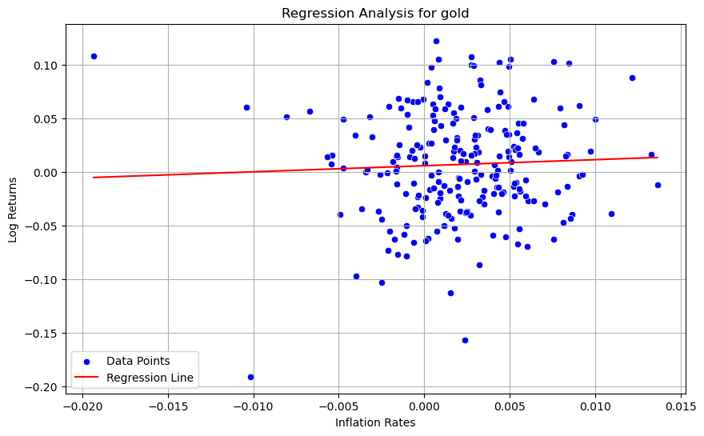
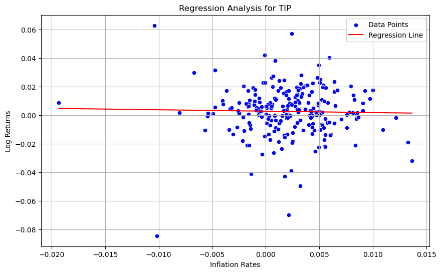
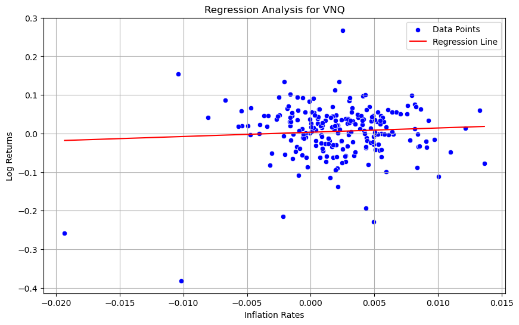
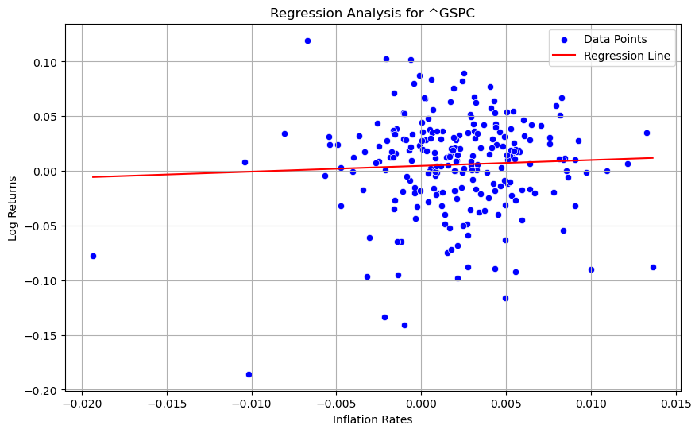

US inflation hedges
==============================
What domestic assets are most useful to US individual investors to hedge against inflation?

## Objective
Our analysis aims to calculate the β coefficient for various asset classes to evaluate their performance as inflation hedges. This involves regression analysis where the asset returns are regressed against inflation rates to understand the extent of their correlation and to quantify the hedging capability of each asset class.

Go to [walkthrough](walkthrough.ipynb) for our results.

## Setup Instructions
1. **API keys**:
   Most data sources require API keys. Store these keys securely using environment variables. We use the `dotenv` approach for this. Please go to https://data.nasdaq.com/sign-up and https://data.bls.gov/registrationEngine/ to register for access to both APIs.
   - Rename `.env.example` to `.env`.
   - Fill in the required API keys or configurations.
   - The application will load these keys automatically.

2. **Run the application with Docker**:
   - Our application is Docker enabled, run the application in the terminal: `docker-compose up`
   - Copy and paste one of the URLs from the terminal into your web browser.

3. **Environment setup**:
   Alternatively, if you do not wish to use Docker, you can follow the steps below to set up a virtual environment.
   - Create a virtual environment: `python -m venv venv_name`
   - Activate the virtual environment:
     - On Windows: `venv_name\Scripts\activate`
     - On Linux/Mac: `source venv_name/bin/activate`
   - Install required libraries: `pip install -r requirements.txt`
   - Test the virtual environment: `python test_environment.py`

4. **View results**:
   Navigate to [walkthrough](walkthrough.ipynb) in the main branch of the directory for our results.

Project Organization
------------

    ├── LICENSE
    ├── README.md          
    ├── data
    │   ├── external       <- Data from third party sources.
    │   ├── interim        <- Intermediate data that has been transformed.
    │   ├── processed      <- The final, canonical data sets for modeling.
    │   └── raw            <- The original, immutable data dump.
    |
    ├── models             <- Model summaries.
    │
    ├── notebooks          <- Jupyter notebooks (working files).
    │
    ├── reports            <- Generated analysis as LaTeX.
    │   └── figures        <- Generated graphics and figures.
    │
    ├── requirements.txt   <- The requirements file for reproducing the analysis environment.
    │
    ├── src                <- Source code for use in this project.
    │   ├── __init__.py    <- Makes src a Python module.
    │   │
    │   ├── data           <- Scripts to download or generate data.
    │   │   └── load_data.py    
    │   │   └── make_dataset.py
    │   │   └── process_data.py
    │   │   └── user_input.py
    │   │
    │   ├── features       <- Scripts to turn raw data into features for modeling.
    │   │   └── build_features.py
    │   │
    │   ├── models         <- Scripts to run model.
    │   │   ├── regression_model.py
    │   │   └── run_regression.py
    │   │
    │   └── visualization  <- Scripts to create exploratory and results oriented visualizations.
    │       └── visualize.py
    │
    └── tox.ini            <- tox file with settings for running tox; see tox.readthedocs.io
    
--------

<small>Project based on the <a target="_blank" href="https://drivendata.github.io/cookiecutter-data-science/">cookiecutter data science project template</a>. #cookiecutterdatascience</small>

