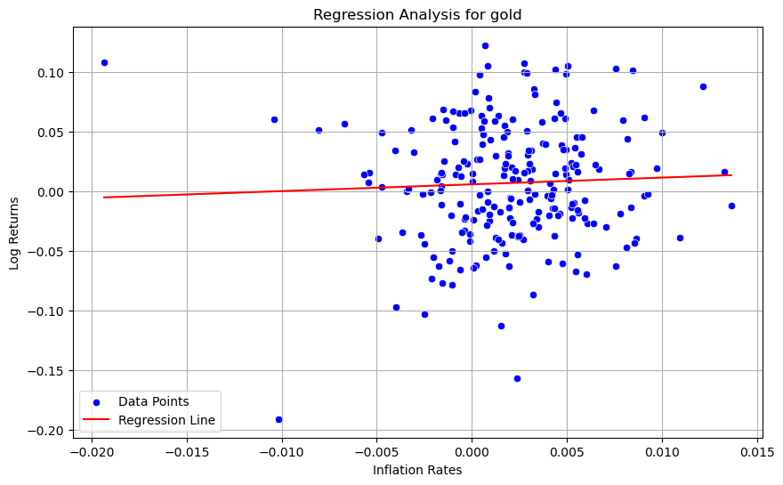

US inflation hedges: What domestic assets are most useful to US individual investors to hedge against inflation?
==============================
## Overview

This analysis is grounded in the Fisher Hypothesis, initially proposed by Fisher in 1930, which establishes a theoretical framework for understanding the relationship between asset returns and inflation. This hypothesis suggests that nominal interest rates are a combination of real returns and the inflation rate. Extending this idea, Fama and Schwert (1977) and later Arnold and Auer (2015) argue that expected nominal returns across various assets are indicative of market expectations about inflation rates.

## Methodology

Our approach involves applying the generalized Fisher hypothesis to examine the inflation hedging capabilities of different asset classes. The formula used is as follows:

r_t = α + β * π_t + ε_t;&nbsp;&nbsp;&nbsp;&nbsp; ε_t ~ N(0, σ_E²)

where,

r_t is the asset return, calculated as the first difference of the natural log of the asset's price.

π_t is the inflation rate, computed as the logarithm of the ratio of the current and previous Consumer Price Index (CPI) values.

β represents the asset's potential to hedge against inflation:
   - Partial Hedge: 0 < β < 1;
   - Full Hedge: β = 1;
   - Superior Performance: β > 1;
   - No Inflation Hedging Potential: β ≤ 0.

To ensure the reliability and validity of our inflation hedging analysis, we implemented robustness checks. These checks are designed to test the stability and consistency of our results under various conditions and assumptions.
   - **Cross-Validation:** We used k-fold cross-validation to evaluate the performance of our regression model across different subsets of the data. This helps in assessing the model's ability to generalize and its performance consistency. The model's R² (coefficient of determination) scores across different folds were analyzed to gauge the variability in its predictive accuracy. Significant variability in these scores might indicate model overfitting or the presence of influential outliers.
   - **Robust Regression Techniques:** To mitigate the influence of outliers or unusual data points, we employed a robust regression methods (Huber). These methods are less sensitive to outliers and provide coefficients that can be more representative of the underlying data trends. By comparing the coefficients from standard linear regression with those from robust regression, we can evaluate the impact of outliers on our findings. A substantial discrepancy between the beta coefficients from standard and robust regressions could suggest that the our model's findings are sensitive to outliers.
   
## Objective
Our analysis aims to calculate the β coefficient for various asset classes to evaluate their performance as inflation hedges. This involves regression analysis where the asset returns are regressed against inflation rates to understand the extent of their correlation and to quantify the hedging capability of each asset class.

## Data Sources
- Secuirites/Equities: Yahoo Finance
- Gold: London Bullion Market via Nasdaq
- CPI Data: US Bureau of Labor Statistics

## Setup Instructions
1. **Environment Setup**:
   - Create a virtual environment: `python -m venv venv_name`
   - Activate the virtual environment:
     - On Windows: `venv_name\Scripts\activate`
     - On Linux/Mac: `source venv_name/bin/activate`
   - Install required libraries: `pip install -r requirements.txt`

2. **API Keys**:
   Most data sources require API keys. Store these keys securely using environment variables. We use the `dotenv` approach for this. Please go to https://data.nasdaq.com/sign-up and https://data.bls.gov/registrationEngine/ to register for access to both APIs.
   - Rename `.env.example` to `.env`.
   - Fill in the required API keys or configurations.
   - The application will load these keys automatically.

3. **Fetching Data**:
   - To populate the raw data folder, run the script [load_data].
   - To output processed data, run the script [make_dataset].
   - To load features run the script [build_features].

4. **Analysis**:
   - To run the regression model on all asset classes and perform robustness checks, run the script [run_regression].
   - To output visualizations, run the script [visualize].

## Sample output data

## Containerize the application
 our application is docker enabled, one can use the following command : `docker compose up` in the terminal to run application,then use the link in the terminal(last line), use jupyter notebook from container
 You can access our notebooks from inside jupyter to run our codes in notebooks directory.

 
Project Organization
------------

    ├── LICENSE
    ├── Makefile           <- Makefile with commands like `make data` or `make train`
    ├── README.md          <- The top-level README for developers using this project.
    ├── data
    │   ├── external       <- Data from third party sources.
    │   ├── interim        <- Intermediate data that has been transformed.
    │   ├── processed      <- The final, canonical data sets for modeling.
    │   └── raw            <- The original, immutable data dump.
    │
    ├── docs               <- A default Sphinx project; see sphinx-doc.org for details
    │
    ├── models             <- Trained and serialized models, model predictions, or model summaries
    │
    ├── notebooks          <- Jupyter notebooks. Naming convention is a number (for ordering),
    │                         the creator's initials, and a short `-` delimited description, e.g.
    │                         `1.0-jqp-initial-data-exploration`.
    │
    ├── references         <- Data dictionaries, manuals, and all other explanatory materials.
    │
    ├── reports            <- Generated analysis as HTML, PDF, LaTeX, etc.
    │   └── figures        <- Generated graphics and figures to be used in reporting
    │
    ├── requirements.txt   <- The requirements file for reproducing the analysis environment, e.g.
    │                         generated with `pip freeze > requirements.txt`
    │
    ├── setup.py           <- makes project pip installable (pip install -e .) so src can be imported
    ├── src                <- Source code for use in this project.
    │   ├── __init__.py    <- Makes src a Python module
    │   │
    │   ├── data           <- Scripts to download or generate data
    │   │   └── load_data.py    
    │   │   └── make_dataset.py
    │   │   └── process_data.py
    │   │   └── user_input.py
    │   │
    │   ├── features       <- Scripts to turn raw data into features for modeling
    │   │   └── build_features.py
    │   │
    │   ├── models         <- Scripts to train models and then use trained models to make
    │   │   │                 predictions
    │   │   ├── regression_model.py
    │   │   └── run_regression.py
    │   │
    │   └── visualization  <- Scripts to create exploratory and results oriented visualizations
    │       └── visualize.py
    │
    └── tox.ini            <- tox file with settings for running tox; see tox.readthedocs.io

--------

<small>Project based on the <a target="_blank" href="https://drivendata.github.io/cookiecutter-data-science/">cookiecutter data science project template</a>. #cookiecutterdatascience</small>

